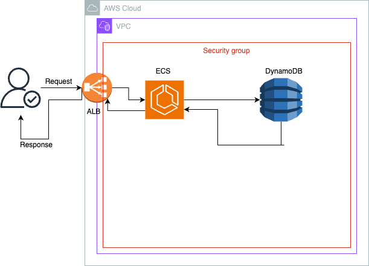

## Minimal Viable Product: Financial Records API v1

The Financial Recorder RESTful API stores financial data in AWS cloud. There will be more features added later in the following API versions see feature road map.  

### Technology 
<ul>
   <li>Java</li>
   <li>Spring Boot</li>
   <li>AWS</li>
   <li>Github Action CI/CD</li>
   <li>JWT</li>
   <li>Terraform</li>
</ul>

### Architecture

This has been kept simple in order to fulfil the basic function of the API which is to store financial data. 



The ECS service will hold the application in a fargate container which is serverless compute service provided by AWS. For the backend databse DynmoDB was picked due to its advantages like being serverless, highly performant and fully managed. The increasing data complexity over time led to decision to use a NoSQL database over relational database for its high performance. This architecture may change over the course of this project.

### Getting Started

To start the dockerised springboot application use the following commands:
```
gradle build 
docker build --build-arg JAR_FILE=/build/libs/*.jar -t financial-api:latest .
docker run -p 8080:8080 financial-api:latest
```

### Steps and Thought process

These are the steps I have taken so far in the project:

- Build the basic Sping Boot application and get it to work with dummy data which I managed to get working. The challenges here was trying to get springboot REST API to return data without Null Pointer Exceptions which I resolved by reading and understanding solutions to these problems on Stack Overflow.
- Build a basic CI/CD pipeline job using a third party vendor. In my case, I used github actions because of the easy of use and convinience.
- Then write a dockerfile to create an image for use in later steps. After the successful functioning of the docker container, I began working on the CI/CD pipeline job to build docker image which required lots of research which paid off after building a successful pipeline that built a docker image and pushed it to AWS.
- Write Terraform code to build infrastructure in AWS and setup a pipeline job to automate infrastructure deployment. This step is where I am at when it comes to the challenges I have faced these include finding out how to write pipeline scripts that does that, pipeline syntax and debugging pipeline job. Currently working on a way to speed up the terraform plan phase of the pipeline.

### Road Map

- Build out the CRUD functionality for the API
- Design and build custom data types to handle complex financial data.
- Add OAuth to API for security.
- Accounting functionality?


